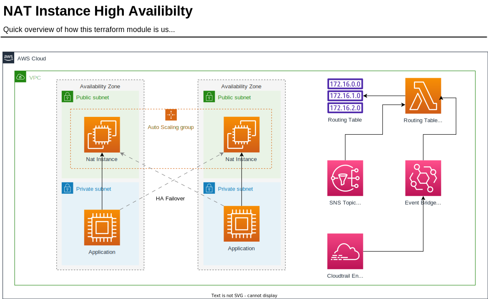

# AWS NAT Instance Terraform module with some HA

This Terraform module provides a flexible way to create highly available NAT instances on AWS.

While I am a proponent of using NAT instances, I would recommend that for production use, it's best to stick with the NAT Gateways provided by AWS or use them instead.

## Prerequisite

- Cloudtrail must be enabled in order to capture ASG events.
- The lambda scripts currently assume that instances have "-nat-" in their name and that private subnets have "-private-" in their name, which may not always be the case. While this approach works, a more flexible solution is being explored.

## Usage

If you already have the VPC setup without terraform, you can put in the id's like this:
```hcl
module "nat" {
  source = "github.com/scamfield/terraform-aws-nat-instance"

  name = module.vpc.name

  aws_key_name = "ssh-key"

  vpc_id = "vpc-056d68ea46d510b09"
  public_subnet_ids  = ["subnet-0873b9d701bf16b22", "subnet-0a9b98b6fefe81141"]
  private_subnet_ids = ["subnet-0619e46d25c65c108", "subnet-0b907bfbb53c10637"]

}
```

If you're utilizing the widely-used [terraform-aws-modules/vpc/aws](https://registry.terraform.io/modules/terraform-aws-modules/vpc/aws) module, you can simply pass in the relevant details from the module. However, make sure that the vpc module is executed first.
```hcl
module "nat" {
  source = "github.com/scamfield/terraform-aws-nat-instance"

  name = module.vpc.name

  aws_key_name = "ssh-key"

  vpc_id = module.vpc.vpc_id
  public_subnet_ids  = module.vpc.public_subnets
  private_subnet_ids = module.vpc.private_subnets

}
```

## How it works

This Terraform module is designed to deploy an auto-scaling group in each availability zone. Each group includes one EC2 instance with a minimum and maximum capacity of one. The group is also configured with an ENI interface that acts as the destination for 0.0.0.0/0 routing table. This design ensures that the auto-scaling group can handle availability zone outages.

In case of a failure within the auto-scaling group, an event is triggered, which is then picked up by EventBridge. EventBridge, in turn, invokes a Lambda function that is authorized to update the routing table for the failed EC2 instance's subnet to a different one.



## Contributing

Report issues/questions/feature requests on in the [issues](https://github.com/scamfield/terraform-aws-nat-instance/issues/new) section.


<!-- BEGIN_TF_DOCS -->
## Requirements

| Name | Version |
|------|---------|
| <a name="requirement_terraform"></a> [terraform](#requirement\_terraform) | >= 0.13.5 |
| <a name="requirement_aws"></a> [aws](#requirement\_aws) | >= 3.22.0 |
| <a name="requirement_template"></a> [template](#requirement\_template) | >= 2.1 |

## Providers

| Name | Version |
|------|---------|
| <a name="provider_aws"></a> [aws](#provider\_aws) | >= 3.22.0 |
| <a name="provider_template"></a> [template](#provider\_template) | >= 2.1 |

## Modules

No modules.

## Resources

| Name | Type |
|------|------|
| [aws_autoscaling_group.asg](https://registry.terraform.io/providers/hashicorp/aws/latest/docs/resources/autoscaling_group) | resource |
| [aws_cloudwatch_log_group.nat_failover_logs](https://registry.terraform.io/providers/hashicorp/aws/latest/docs/resources/cloudwatch_log_group) | resource |
| [aws_eip.eip](https://registry.terraform.io/providers/hashicorp/aws/latest/docs/resources/eip) | resource |
| [aws_iam_instance_profile.nat_profile](https://registry.terraform.io/providers/hashicorp/aws/latest/docs/resources/iam_instance_profile) | resource |
| [aws_iam_policy.nat_failover_lambda_policy](https://registry.terraform.io/providers/hashicorp/aws/latest/docs/resources/iam_policy) | resource |
| [aws_iam_role.nat_failover_lambda](https://registry.terraform.io/providers/hashicorp/aws/latest/docs/resources/iam_role) | resource |
| [aws_iam_role.role](https://registry.terraform.io/providers/hashicorp/aws/latest/docs/resources/iam_role) | resource |
| [aws_iam_role_policy.modify_routes](https://registry.terraform.io/providers/hashicorp/aws/latest/docs/resources/iam_role_policy) | resource |
| [aws_iam_role_policy_attachment.nat_failover_lambda](https://registry.terraform.io/providers/hashicorp/aws/latest/docs/resources/iam_role_policy_attachment) | resource |
| [aws_lambda_function.nat_failover_lambda](https://registry.terraform.io/providers/hashicorp/aws/latest/docs/resources/lambda_function) | resource |
| [aws_lambda_permission.allow_sns](https://registry.terraform.io/providers/hashicorp/aws/latest/docs/resources/lambda_permission) | resource |
| [aws_launch_template.launch_template](https://registry.terraform.io/providers/hashicorp/aws/latest/docs/resources/launch_template) | resource |
| [aws_network_interface.eni](https://registry.terraform.io/providers/hashicorp/aws/latest/docs/resources/network_interface) | resource |
| [aws_security_group.sg_nat](https://registry.terraform.io/providers/hashicorp/aws/latest/docs/resources/security_group) | resource |
| [aws_security_group_rule.sgr_nat_inbound](https://registry.terraform.io/providers/hashicorp/aws/latest/docs/resources/security_group_rule) | resource |
| [aws_security_group_rule.sgr_nat_out](https://registry.terraform.io/providers/hashicorp/aws/latest/docs/resources/security_group_rule) | resource |
| [aws_sns_topic.nat_failover_topic](https://registry.terraform.io/providers/hashicorp/aws/latest/docs/resources/sns_topic) | resource |
| [aws_sns_topic_subscription.nat_failover_lambda](https://registry.terraform.io/providers/hashicorp/aws/latest/docs/resources/sns_topic_subscription) | resource |
| [aws_ami.ami](https://registry.terraform.io/providers/hashicorp/aws/latest/docs/data-sources/ami) | data source |
| [aws_caller_identity.current](https://registry.terraform.io/providers/hashicorp/aws/latest/docs/data-sources/caller_identity) | data source |
| [aws_iam_policy_document.assume_role_policy](https://registry.terraform.io/providers/hashicorp/aws/latest/docs/data-sources/iam_policy_document) | data source |
| [aws_iam_policy_document.policy](https://registry.terraform.io/providers/hashicorp/aws/latest/docs/data-sources/iam_policy_document) | data source |
| [aws_region.current](https://registry.terraform.io/providers/hashicorp/aws/latest/docs/data-sources/region) | data source |
| [aws_subnet.eni_subnet](https://registry.terraform.io/providers/hashicorp/aws/latest/docs/data-sources/subnet) | data source |
| [aws_subnet.first](https://registry.terraform.io/providers/hashicorp/aws/latest/docs/data-sources/subnet) | data source |
| [aws_subnet.subnets](https://registry.terraform.io/providers/hashicorp/aws/latest/docs/data-sources/subnet) | data source |
| [aws_vpc.vpc](https://registry.terraform.io/providers/hashicorp/aws/latest/docs/data-sources/vpc) | data source |
| [template_cloudinit_config.cloudinit](https://registry.terraform.io/providers/hashicorp/template/latest/docs/data-sources/cloudinit_config) | data source |
| [template_file.cloudinit_base](https://registry.terraform.io/providers/hashicorp/template/latest/docs/data-sources/file) | data source |
| [template_file.nat_failover_systemd](https://registry.terraform.io/providers/hashicorp/template/latest/docs/data-sources/file) | data source |
| [template_file.nat_failover_trigger_script](https://registry.terraform.io/providers/hashicorp/template/latest/docs/data-sources/file) | data source |

## Inputs

| Name | Description | Type | Default | Required |
|------|-------------|------|---------|:--------:|
| <a name="input_aws_key_name"></a> [aws\_key\_name](#input\_aws\_key\_name) | n/a | `string` | `""` | no |
| <a name="input_instance_type"></a> [instance\_type](#input\_instance\_type) | n/a | `string` | `"t4g.micro"` | no |
| <a name="input_name"></a> [name](#input\_name) | n/a | `string` | `"default"` | no |
| <a name="input_private_subnet_ids"></a> [private\_subnet\_ids](#input\_private\_subnet\_ids) | n/a | `list(string)` | n/a | yes |
| <a name="input_public_subnet_ids"></a> [public\_subnet\_ids](#input\_public\_subnet\_ids) | n/a | `list(string)` | n/a | yes |
| <a name="input_vpc_id"></a> [vpc\_id](#input\_vpc\_id) | n/a | `string` | n/a | yes |

## Outputs

No Outputs.
<!-- END_TF_DOCS -->

## Known Issues

If you come across the following error during deployment, it might be because the subnets have not been created yet or are invalid. This is due to looping through the subnets, causing the error to occur:
```
Error: Invalid for_each argument
│
│   on .terraform/modules/nat/data.tf line 36, in data "aws_subnet" "subnets":
│   36:   for_each = toset(concat(var.private_subnet_ids, var.public_subnet_ids))
│     ├────────────────
│     │ var.private_subnet_ids is list of string with 2 elements
│     │ var.public_subnet_ids is list of string with 2 elements
│
│ The "for_each" value depends on resource attributes that cannot be determined until apply, so Terraform cannot
│ predict how many instances will be created. To work around this, use the -target argument to first apply only the
│ resources that the for_each depends on.
```

## Authors

Module is maintained by [Stephen Camfield](https://github.com/scamfield)  with help from [these awesome contributors](https://github.com/scamfield/terraform-aws-nat-instance/graphs/contributors).

# License
